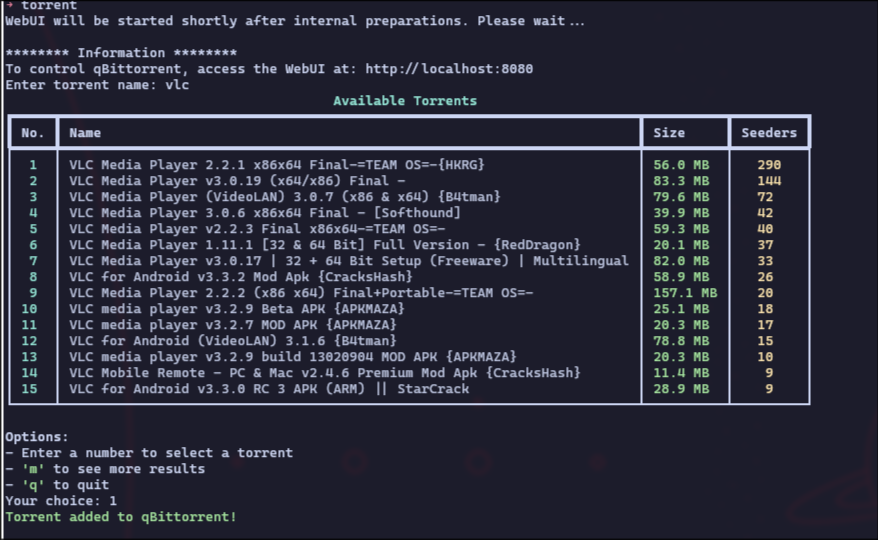

# cli_torrent_search

A simple CLI script to search torrents and send them directly to qBittorrent using the WebUI.

Supports **GNU/Linux**,**Termux** and **Windows**.

---

##  Requirements

### Common:
- Python 3
- qBittorrent with WebUI **enabled**

### For GNU/Linux:
- `qbittorrent-nox` (headless version)
- `qbittorrent`
- Python packages:
  ```
  pip install -r requirements.txt
  ```

### For Windows:
- Installed qBittorrent (desktop version)
- Edit path to `qbittorrent.exe` in the script

---

## Setup

### Linux:

1. Clone the repo:
   ```bash
   git clone https://github.com/nazalnihad/cli_torrent_search.git
   cd cli_torrent_search
   ```

2. Create virtual environment (optional but recommended):
   ```bash
   python3 -m venv venv
   source venv/bin/activate
   pip install -r requirements.txt
   ```

3. Enable qBittorrent WebUI:
   - Open qBittorrent.
   - Go to **Tools → Options → Web UI**.
   - Enable Web UI.
   - Set a username/password.
   - Set port (default is `8080`).
   - Optional: Tick **Bypass authentication for localhost**.

4. Edit your credentials in the script:
   ```python
   QB_USERNAME = "your_username"
   QB_PASSWORD = "your_password"
   ```

5. Run using:
    after making it executable with env and the file
   ```bash
   ./torrent 
   ```

   Or run the Python script directly:
   ```bash
   python fetcher.py
   ```

### Windows:

1. Install qBittorrent and enable WebUI (see above).

2. Edit `windows_version.py` in windows folder:
   - Set the correct path to `qbittorrent.exe`.
   - Update WebUI username/password.

3. Run:
   ```bash
   python windows_version.py
   ```
   
### Android (Termux)

1. Install dependencies:
   ```bash
   pkg update
   pkg install python aria2 termux-api
   pip install -r requirements.txt
   ```

2. Setup storage access:
   ```bash
   termux-setup-storage
   ```

4. Run:
   ```bash
   python mobile.py
   ```
   Or:
   ```bash
   python aria_v.py (cli only version)
   ```

---

##  Usage

- Run the script.
- Enter the torrent name.
- Select the result from the numbered list.
- It will resolve the magnet link and add it to qBittorrent or any torrent client in mobile.

---

##  Notes

- If you see **API errors**, change the URL in the script to a working Librex instance:
  ```python
  # Example:
  url = "https://search.decentrala.org/api.php?q={name}&p=0&t=3"
  ```

- If WebUI connection fails:
  - Check firewall settings.
  - Ensure port `8080` is not blocked.
  - Try enabling the “Bypass authentication for localhost” option in WebUI settings.

---

## Screenshots




---

## Contribute

This was built for personal use and might not be fully portable for every system.  
Feel free to tweak, fork, or make a better version.

---

